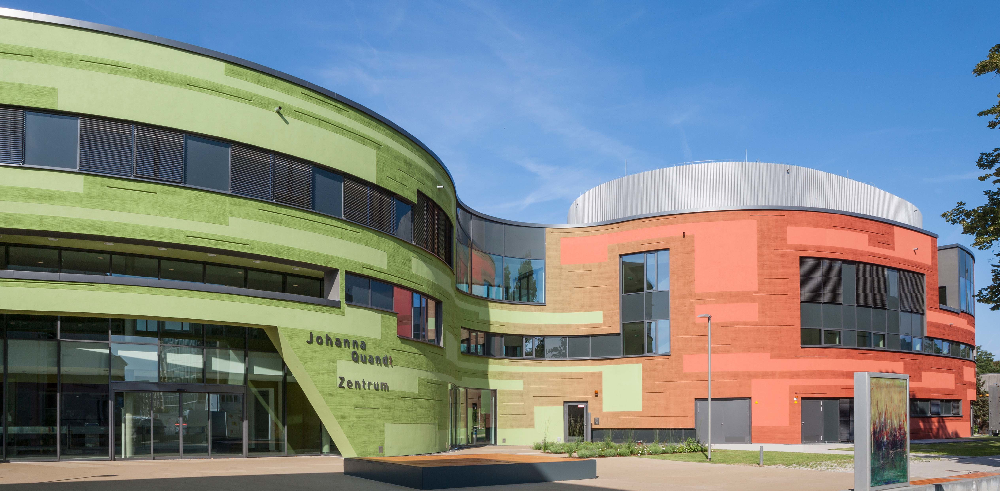
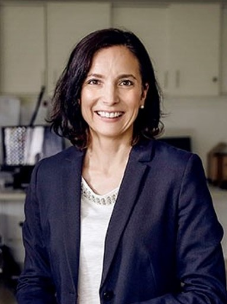

# Contact

---

ADDRESS

<a style="color: #061d4e; font-size:110%">Ullrich Lab</a>
\
Laboratory for Experimental Immunology & Cell Therapy\
Department of Pediatrics, Goethe University\
Theodor-Stern-Kai 7\
Building 32 E, 2nd Floor\
60590 Frankfurt am Main

:::: {.columns}

::: {.column width="50%"}

HEAD

Prof. Dr. med. Evelyn Ullrich

University Professorship - Chair of Personalized Immune Cell Therapy (PICT)

Head of Research & Development at the Institute for Transfusion Medicine and Gene Therapy at the Universiy Medical Center Freiburg

Additional certification Immunology Specialist / Immunologist DGfI

<i class="bi-envelope"></i> evelyn | ullrichlab.de

<i class="bi-telephone"></i> 

<i class="bi-linkedin"></i> [Evelyn Ullrich](https://www.linkedin.com/in/evelyn-ullrich-72456b326/)

&emsp;

LABORATORY

 To be announced 

<i class="bi-envelope"></i>

<i class="bi-telephone"></i>

<i class="bi-phone"></i>

:::

::: {.column width="5%"}
<!-- empty column to create gap -->
:::

::: {.column width="45%"}

SCIENTIFIC PROJECT COORDINATION

Dr. rer. nat. Thorsten Diegisser

Scientific Project Coordinator

Working hours: Monday, Wednesday, Thursday 08:00-12:00

<i class="bi-envelope"></i> diegisser | med.uni-frankfurt.de

<i class="bi-phone"></i> +49 151 150 96319

&emsp;

CAREER DEVELOPMENT

Stephanie Faber

INDEEP Clinician Scientist Program

<i class="bi-envelope"></i> faber | med.uni-frankfurt.de

<i class="bi-phone"></i> +49 151 171 92247

:::
::::

